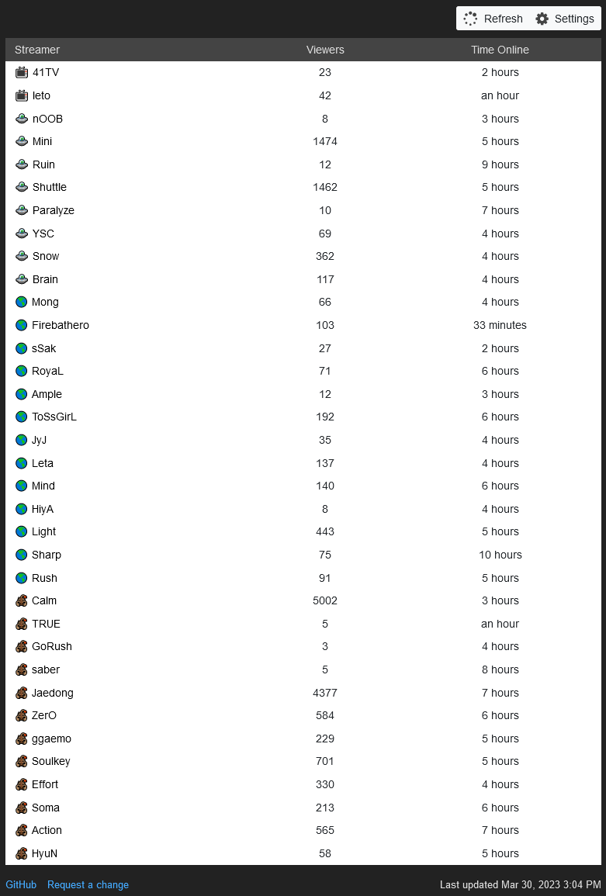

# bwstreams

## Overview

bwstreams is a Python 2 Google App Engine app that tracks Brood War streams from [AfreecaTV](http://afreecatv.com). See it live at https://bwstreams.appspot.com.

## Setting up the Development Server

1. Install Python 3
2. Install the [Google Cloud SDK](https://cloud.google.com/appengine/docs/standard/python/download)

## Starting the Development Server

1. `./dev_appserver`

### Useful Google Cloud Commands

- gcloud app versions list
- gcloud app versions delete
- gcloud meta list-files-for-upload
- gcloud app deploy

### Run Local Server

`python3 -m http.server 8000`
